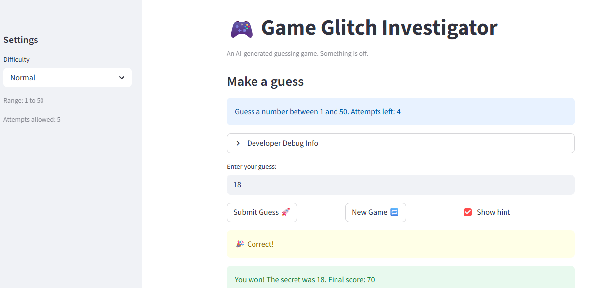

# 🎮 Game Glitch Investigator: The Impossible Guesser

## 🚨 The Situation

You asked an AI to build a simple "Number Guessing Game" using Streamlit.
It wrote the code, ran away, and now the game is unplayable. 

- You can't win.
- The hints lie to you.
- The secret number seems to have commitment issues.

## 🛠️ Setup

1. Install dependencies: `pip install -r requirements.txt`
2. Run the broken app: `python -m streamlit run app.py`

## 🕵️‍♂️ Your Mission

1. **Play the game.** Open the "Developer Debug Info" tab in the app to see the secret number. Try to win.
2. **Find the State Bug.** Why does the secret number change every time you click "Submit"? Ask ChatGPT: *"How do I keep a variable from resetting in Streamlit when I click a button?"*
3. **Fix the Logic.** The hints ("Higher/Lower") are wrong. Fix them.
4. **Refactor & Test.** - Move the logic into `logic_utils.py`.
   - Run `pytest` in your terminal.
   - Keep fixing until all tests pass!

## 📝 Document Your Experience

- [ ] Describe the game's purpose.

      The purpose of the game is to guess a randomly generated secret number within a limited number of attempts. The player selects a difficulty level, which determines the range of possible numbers and the number of attempts allowed. After each guess, the game gives a hint indicating whether the guess was too high or too low. The goal is to correctly guess the secret number before running out of attempts while accumulating points based on performance.

- [ ] Detail which bugs you found.

      One bug I found was that the hint messages were backwards. When my guess was higher than the secret number, the game told me to guess higher instead of lower, and the opposite happened when my guess was too low. Another issue was that the "New Game" button did not properly reset the game state, which caused attempts and status values from the previous game to persist and prevented the new game from working correctly. I also noticed that the difficulty ranges were inconsistent: Hard mode used a smaller range than Normal mode, and in some cases the secret number could still fall outside the intended range.

- [ ] Explain what fixes you applied.

      To fix the hint bug, I updated the logic in the check_guess function so that when the guess is greater than the secret number the hint tells the player to go lower, and when the guess is lower it tells the player to go higher. I also refactored the main game logic by moving functions from app.py into logic_utils.py so they could be tested independently using pytest. For the new game issue, I reset the relevant st.session_state variables (attempts, score, status, history, and secret) when the "New Game" button is pressed. Finally, I corrected the difficulty ranges so the number ranges match the intended difficulty levels.

## 📸 Demo

- [ ] 

## 🚀 Stretch Features

- [ ] [If you choose to complete Challenge 4, insert a screenshot of your Enhanced Game UI here]
